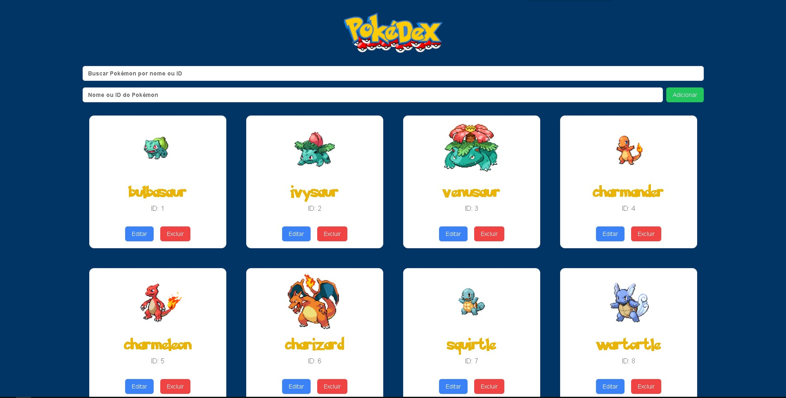

# POKEDEX - APLICAÇÃO WEB DE POKÉMON  

  

## 🌐 DEMONSTRAÇÃO ONLINE  

Acesse a aplicação online:  
🔗 [Pokédex na Vercel](https://pokedex-tiago-barros.vercel.app)  

## 🎯 OBJETIVO  

O objetivo deste projeto foi desenvolver uma aplicação web utilizando **Next.js**, **Tailwind CSS** e **Node.js**. A aplicação consome a **PokéAPI** para exibir uma lista de Pokémon e permite a interação do usuário com funcionalidades de **criação**, **edição**, **exclusão** e **filtro** de Pokémon.  

A aplicação é responsiva e interativa, proporcionando uma experiência de usuário intuitiva e agradável.  

## ⚡ FUNCIONALIDADES  

- **Listagem de Pokémon:** Exibe uma lista inicial com pelo menos 12 Pokémon consumidos da API pública (PokéAPI).  
- **Criação de Pokémon:** Permite adicionar novos Pokémon à lista (mockados no frontend).  
- **Edição de Pokémon:** Possibilita a alteração do nome de um Pokémon.  
- **Exclusão de Pokémon:** Permite excluir um Pokémon da lista.  
- **Filtro de Pokémon:** Implementa um campo de busca para filtrar os Pokémon pelo nome e ID.  

## 🛠️ TECNOLOGIAS UTILIZADAS  

- **Next.js** → Framework React para desenvolvimento de aplicações web.  
- **Tailwind CSS** → Framework de estilização baseado em classes utilitárias para design responsivo e rápido.  
- **React.js** → Biblioteca JavaScript para criação de interfaces de usuário.  
- **Node.js** → Ambiente de execução para código JavaScript do lado do servidor.  
- **React Query** → Biblioteca para gerenciamento de dados assíncronos (usada para consumir a PokéAPI).  
- **PokéAPI** → API pública que fornece informações sobre Pokémon.  

## 📌 REQUISITOS  

Antes de rodar o projeto localmente, você precisa ter os seguintes pré-requisitos:  

- Node.js e npm instalados na sua máquina.  
- Acesso à internet para consumo da **PokéAPI**.  

## 🚀 INSTALAÇÃO E USO  

1. Clone este repositório para o seu computador:  
   ```bash
   git clone https://github.com/seu-usuario/pokedex.git

2. Navegue até o diretório do projeto:  
   ```bash
   cd pokedex

3. Instale as dependências:
   ```bash
   npm install

4. Inicie o servidor local:  
   ```bash
   npm run dev

5. Acesse a aplicação em http://localhost:3000.  

## 📁 ESTRUTURA DO PROJETO

- pages/ → Contém as páginas principais da aplicação.
- components/ → Componentes reutilizáveis, como os cards de Pokémon.
- hooks/ → Hooks personalizados para gerenciamento da lista de Pokémon.
- styles/ → Arquivos de estilo, configurados com Tailwind CSS.

## 🎨 REQUISITOS DE UI/UX
✔️ Interface responsiva e adaptável a diferentes dispositivos.<br>
✔️ Lista de Pokémon exibida em cards com imagem, nome e ID.<br>
✔️ Botões de editar e excluir visíveis em cada card.<br>
✔️ Botão de adicionar Pokémon no topo da lista.<br>